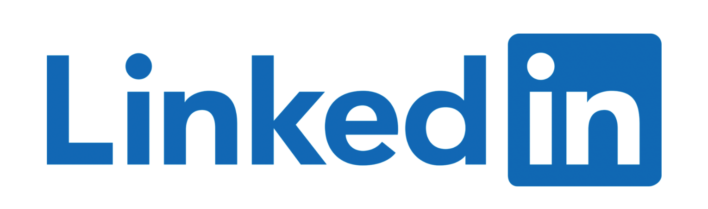

<!-- PROJECT LOGO -->
 

  

<h3 align="center">LinkedIn - Clone</h3>

  

    A project that clones LinkedIn, developed during Strive School's Full Stack course!
     
     
    <a href="https://my-linkedin-benchmarkm6.vercel.app/">View Demo</a>
    <!-- ·
    <a href="https://github.com/Nando-C/Buildweek2/issues">Report Bug</a> -->
  

<!-- TABLE OF CONTENTS -->

  
Table of Contents

  <ol>
    <li>
      <a href="#about-the-project">About The Project</a>
      <ul>
        <li><a href="#built-with">Built With</a></li>
      </ul>
    </li>
    <li><a href="#usage">Usage</a></li>
    <li><a href="#contact">Contact</a></li>
  </ol>

<!-- ABOUT THE PROJECT -->

## About The Project

<!-- [![Product Name Screen Shot][product-screenshot]](https://example.com) -->

Front-End for a LinkedIn clone project, created as part of the Full Stack Master Camp at Strive School.
Developed in 4 days by a distributed team of 3 students.

This repo is a fork of the original team work, with some adjustments made in order to connect it with the Back-End which you can find here:[LinkedIn's BackEnd](https://github.com/Nando-C/BuildWeek3)

(<a href="#top">back to top</a>)

### Built With

- [Node.js](https://nodejs.org/)
- [React.js](https://reactjs.org/)
- [Bootstrap](https://getbootstrap.com)

(<a href="#top">back to top</a>)

<!-- USAGE EXAMPLES -->

## Usage

- Once you open the application, you will land on the the home page, where you can see all the posts made from you and your network.
- Here you can create, edit and delete your posts.
- To go to your profile, simply click on the avatar picture on the navigation bar.
- From here you can edit your profile details and picture.
- Also you can create, edit and delete your work experience and the respective company's icon.

- As an added feature, you are able to export your CV as pdf and your experiences as .csv

(<a href="#top">back to top</a>)

<!-- CONTACT -->

## Contact

By [@Nando](https://hernando-crespo.vercel.app/) - feel free to contact me!

(<a href="#top">back to top</a>)

