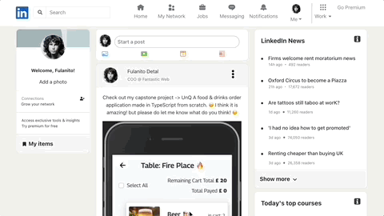
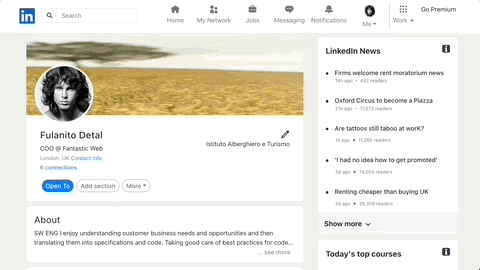

<!-- PROJECT LOGO -->
 

  

<h3 align="center">LinkedIn - Clone  -> [Front-End]</h3>

  

    A project that clones LinkedIn, developed during Strive School's Full Stack program!
     
     
    <a href="https://my-linkedin-benchmarkm6.vercel.app/">View Demo</a>
    <!-- ·
    <a href="https://github.com/Nando-C/Buildweek2/issues">Report Bug</a> -->
  

<!-- TABLE OF CONTENTS -->

  
Table of Contents

  <ol>
    <li>
      <a href="#about-the-project">About The Project</a>
      <ul>
        <li><a href="#built-with">Built With</a></li>
      </ul>
    </li>
    <li><a href="#usage">Usage</a>
     <ul>
        <li><a href="#posts">Posts</a></li>
        <li><a href="#profile">Profile</a></li>
        <li><a href="#downloads">Downloads</a></li>
      </ul>
    </li>
    <li><a href="#contact">Contact</a></li>
  </ol>

<!-- ABOUT THE PROJECT -->

## About The Project

<!-- [![Product Name Screen Shot][product-screenshot]](https://example.com) -->

This is the Front-End for a LinkedIn clone project, created as part of the Full Stack Master Camp at Strive School.
Developed in 4 days by a distributed team of 3 students.

This repo is a fork of the original team work, with some adjustments made in order to connect it with the Back-End, which was develped with a different team and can be found here: [LinkedIn's BackEnd](https://github.com/Nando-C/BuildWeek3)

(<a href="#top">back to top</a>)

### Built With

- [Node.js](https://nodejs.org/)
- [React.js](https://reactjs.org/)
- [Bootstrap](https://getbootstrap.com)

(<a href="#top">back to top</a>)

<!-- USAGE EXAMPLES -->

## Usage

### Posts

- When you open the application, you will land on the the home page, where you can see all the posts made from you and your network.

    

- Here you can create, edit and delete your posts.

    

(<a href="#top">back to top</a>)

### Profile

- By clicking on the avatar picture of the navigation bar, you can can access the profile page, where you can edit your details and update your picture.

    

- Also you can create, delete and edit your work experience details.

    

(<a href="#top">back to top</a>)

### Downloads

- As an added feature, you are able to export your CV as .pdf and your experiences as .csv

    

(<a href="#top">back to top</a>)

<!-- CONTACT -->

## Contact

[@Nando](https://hernando-crespo.vercel.app/) - Get in touch and let me know what do you think of this project! 😉

(<a href="#top">back to top</a>)

